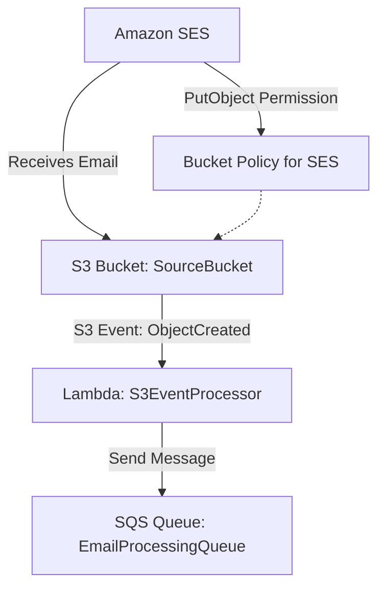

# Email Processing

A resilient way to process incoming emails in Laravel using AWS.

## How it works

1. A user sends an email to an already verified email address in the AWS account.
2. SES receives the email and creates a new object in an S3 bucket.
3. S3 sends an `s3:ObjectCreated:*` event to Lambda.
4. Lambda processes the incoming S3 event and creates a new Laravel formatted message to add to the SQS queue.

